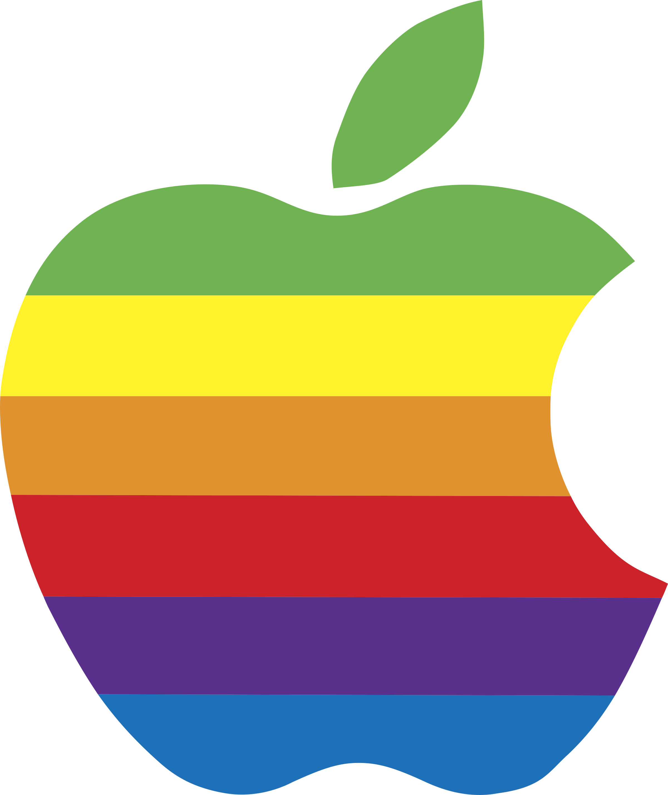

<div id="top"></div>

<!-- HEADER -->
<br />
<div align="center">
    

  <h2 align="center">My MacOS Dotfiles</h2>

  <p align="center">
    Configs for Mac OS, yabai, skhd, and iTerm2.
    <br />
    <br />
  </p>
</div>

<!-- ABOUT -->
## About


This repo is to serve as a backup to myself (or anyone interested) of my configurations for Mac OS.

### Built With

* [Stow](https://www.gnu.org/software/stow/)
* [Bash](https://www.gnu.org/software/bash/)

<!-- GETTING STARTED -->
## Getting Started

### Prerequisites

Apple Mac device.

### Installation

1. Clone the repo

2. Auto deploy

The `install.sh` script will take care of updating the system and installing programs. 

```bash
cd mac
```

```bash
chmod +x install.sh
```

```bash
./install.sh
```